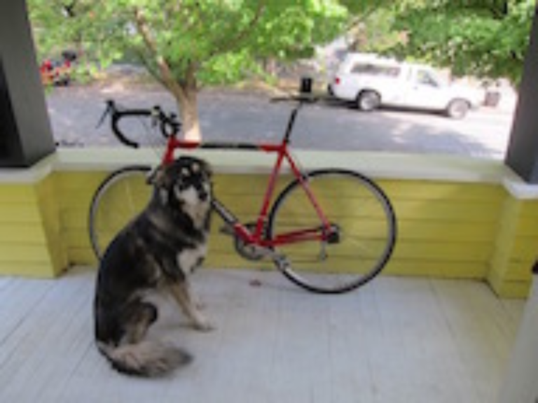

# Homework 1 #

Welcome friends,

It's time for assignment 1! This one may be a little harder than the last one so remember to start early and start often! In order to make grading easier, please only edit the files we mention. You will submit the `resize_image.c` file on Canvas.

## 1. Image resizing ##

We've been talking a lot about resizing and interpolation in class, now's your time to do it! To resize we'll need some interpolation methods and a function to create a new image and fill it in with our interpolation methods.

### 1.1 Nearest Neighbor Interpolation ###

Fill in `float nn_interpolate(image im, float x, float y, int c);` in `src/resize_image.c`

It should perform nearest neighbor interpolation. Remember to use the closest `int`, not just type-cast because in C that will truncate towards zero.

### 1.2 Nearest Neighbor Resizing ###

Fill in `image nn_resize(image im, int w, int h);`. It should:
- Create a new image that is `w x h` and the same number of channels as `im`
- Loop over the pixels and map back to the old coordinates
- Use nearest-neighbor interpolate to fill in the image

Now you should be able to run the following `python` command:

    from uwimg import *
    im = load_image("data/dogsmall.jpg")
    a = nn_resize(im, im.w*4, im.h*4)
    save_image(a, "dog4x-nn")

Your image should look something like:

### 1.3 Bilinear Interpolation ###

Finally, fill in the similar functions `bilinear_interpolate` and....

### 1.4 Bilinear Resizing ###

`bilinear_resize` to perform bilinear interpolation. Try it out again in `python`:

    from uwimg import *
    im = load_image("data/dogsmall.jpg")
    a = bilinear_resize(im, im.w*4, im.h*4)
    save_image(a, "dog4x-bl")

These functions will work fine for small changes in size, but when we try to make our image smaller, say a thumbnail, we get very noisy results:

    from uwimg import *
    im = load_image("data/dog.jpg")
    a = nn_resize(im, im.w//7, im.h//7)
    save_image(a, "dog7th-bl")

As we discussed, we need to filter before we do this extreme resize operation!

## Turn it in ##

Turn in your `resize_image.c` on canvas under Assignment 1.

